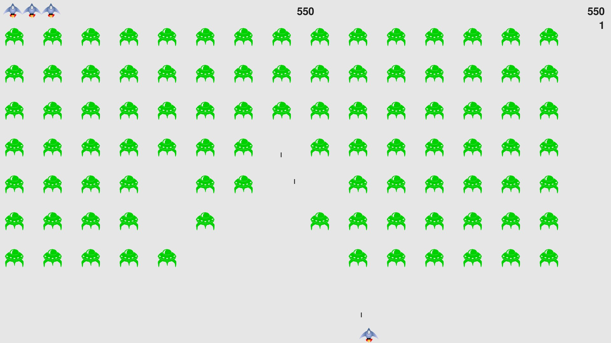

# alien-invasion

Alien Invasion game from Python Crash Course book



## Add Pygame package when using PyCharm

The Alien Invasion game requires the Pygame package to be installed.
If it is missing, PyCharm will show the following error:


To add the package for the Alien Invasion game, move the cursor to *import pygame* and press *Alt-enter*. The following popup menu should be shown:


To install the Pygame package, select *Install package pygame*. This only works when using a correctly configured virtual environment.

## Installing Pygame

To install Pygame for the current user, enter the following command at a terminal prompt:

```
$ python -m pip install --user pygame
```

To install Pygame globally on Debian based systems, do:

```
# apt-get install python3-pygame
```

# Quitting the game

The alien invasion game will start in fullscreen mode. To exit the game, type 'q'
